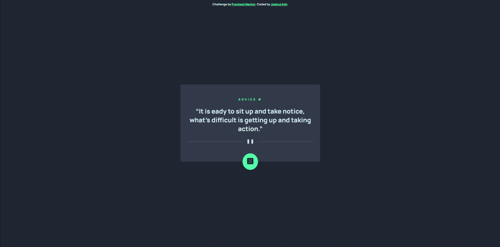
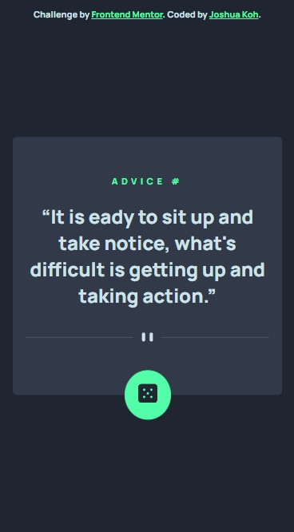

# Frontend Mentor - Advice generator app solution

This is a solution to the [Advice generator app challenge on Frontend Mentor](https://www.frontendmentor.io/challenges/advice-generator-app-QdUG-13db). Frontend Mentor challenges help you improve your coding skills by building realistic projects.

## Table of contents

- [Overview](#overview)
  - [The challenge](#the-challenge)
  - [Screenshot](#screenshot)
  - [Links](#links)
- [My process](#my-process)
  - [Built with](#built-with)
  - [What I learned](#what-i-learned)
- [Author](#author)

## Overview

This is a challenge from Frontend Mentor to build a advice generator app using the [Advice Slip API](https://api.adviceslip.com).

### The challenge

Users should be able to:

- View the optimal layout for the app depending on their device's screen size
- See hover states for all interactive elements on the page
- Generate a new piece of advice by clicking the dice icon

### Screenshot




### Links

- Solution URL: [Add solution URL here](https://your-solution-url.com)
- Live Site URL: [https://joshuakme.github.io/fm-advice-generator-app-main/](https://joshuakme.github.io/fm-advice-generator-app-main/)

## My process

I took around 1 and hald hour to complete this challenge. Actually it is not really that hard, but I learned how to add loading spinner when the advice is not loaded on the client device. This is my extra work on improving the user usability which I always try to practice.

### Built with

- Semantic HTML5 markup
- CSS custom properties

### What I learned

I've learned how to add loading spinner when the advice is not fully loaded yet. So, basically the concept is by initializing the loading spinner when the user click on the dice button, and when we fetch the data from the API, and when it is loaded, we stop the loading spinner and bring in the data.

```js
// Elements
const diceBtn = document.getElementById("dice");

diceBtn.addEventListener("click", async () => {
  startLoading();

  const res = await fetch(api_address);
  const data = await res.json();
  stopLoaded();

  id = data.slip.id;
  quote = data.slip.advice;

  title.innerText = `ADVICE # ${id}`;
  quoteText.innerText = `${quote}`;
});

// Functions
function startLoading() {
  quoteText.style.display = "none";
  loadingRing.style.display = "inline-block";
}

function stopLoading() {
  loadingRing.style.display = "none";
  quoteText.style.display = "block";
}
```

## Author

- Website - [Joshua Koh](https://github.com/Joshuakme)
- Frontend Mentor - [@Joshuakme](https://www.frontendmentor.io/profile/Joshuakme)
- Twitter - [@josh_ennn33](https://twitter.com/josh_ennn33)
